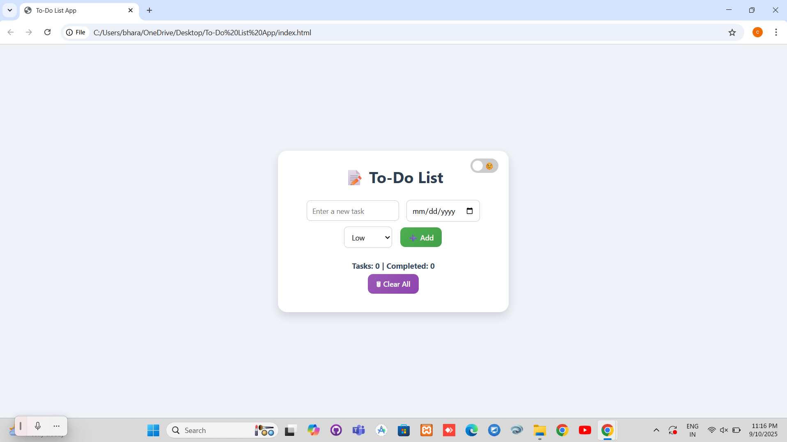

# 📝 To-Do List App

A responsive and interactive **To-Do List Application** built using only **HTML, CSS, and JavaScript**.  
This app helps users manage tasks with features like **adding, editing, deleting, marking complete, due dates, priority levels, and dark/light mode**.  
All tasks are saved in the **browser’s Local Storage**, so they remain even after refreshing the page.

---

## 🚀 Features
- ➕ Add new tasks
- ✏️ Edit existing tasks
- ✅ Mark tasks as complete/incomplete
- ❌ Delete tasks
- 📅 Set **due dates** for tasks (overdue dates turn red)
- 🔼 Assign **priority levels** (Low, Medium, High)
- 🌓 Toggle between **Dark Mode & Light Mode**
- 💾 Data persistence with **Local Storage**
- 📱 Fully responsive for mobile and desktop 

---

## 🛠️ Built With
- **HTML** – Structure of the app  
- **CSS** – Styling and responsive design  
- **JavaScript** – App logic and local storage handling  

---

## Live Demo
👉 [Click here to try the To-Do List App](https://chandana351.github.io/todo-list-app/)


---

## ⚙️ How to Run Locally
1. Clone this repository:
   ```bash
   git clone https://github.com/your-username/todo-list-app.git
2. Open the folder in your system.
3. Run index.html in your browser

---
## 📸 Screenshot
Here’s how the app looks 


